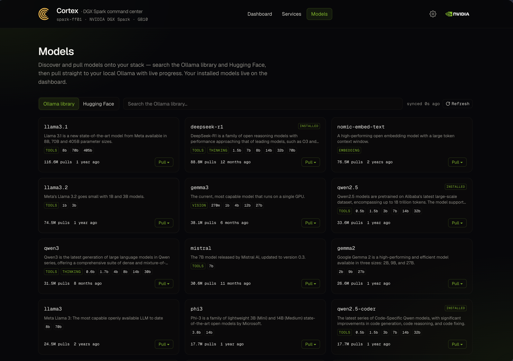
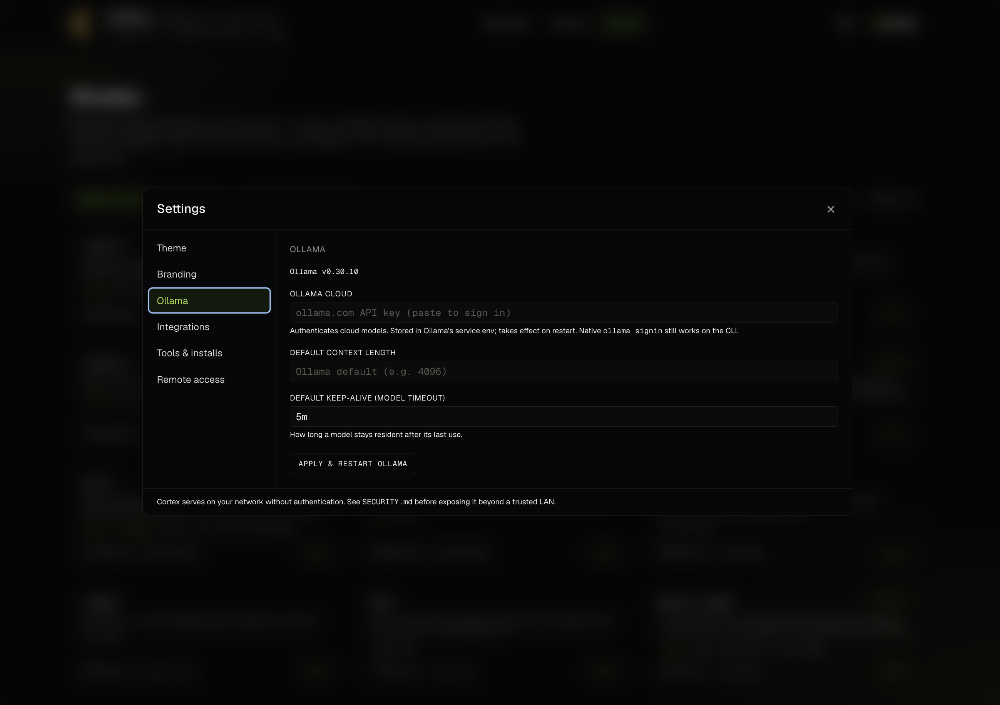

# Cortex

**A self-hostable command center for your local AI stack on NVIDIA GB10 platforms.**

Cortex is a self-hostable web UI for a local AI stack. It gives you a single landing
page and live dashboard: system and GPU health, the models currently loaded across your
inference and image tools, and a configurable catalog of the services you run (Ollama,
ComfyUI, Open WebUI, and more).

Cortex is built specifically for [NVIDIA GB10-based platforms](https://www.nvidia.com/en-us/products/workstations/dgx-spark/) —
it was developed on the **NVIDIA DGX Spark**, the GB10-powered reference platform — and
it's themable so you can brand it as your own.

## Why Cortex?

The DGX Spark ships with a clean dashboard that gets you up and running quickly. Spending
time with ours, we just found we wanted a deeper, at-a-glance view of what the box was
doing day to day — which models are resident in memory right now, per-model context
windows, GPU **power draw** (the only reliable activity signal on GB10's unified-memory
architecture — see below), host OS / kernel / driver versions, and a live health check for
every service we run. That level of detail turned out to be genuinely useful, so we pulled
it all onto a single pane of glass. Cortex is the result.

> **On the name:** the cerebral *cortex* is the brain's integrative layer — a fitting
> name for the surface that pulls together signals from all of your local-AI tools.

## Screenshots


*The dashboard live on a DGX Spark: power-primary GPU telemetry (utilization is unreliable on
GB10, so power leads), system + host versions, and the full model inventory — with per-model
context windows, the resident models' keep-alive (pinned vs. time-left), and load / unload /
remove controls.*



*Model discovery: search the **Ollama library** and **Hugging Face**, then pull straight to your
local Ollama with live, server-tracked download progress. Your installed models stay on the
dashboard.*



*Settings is a tabbed modal — Theme, Branding, Ollama, Integrations, Tools, and Remote access.
The **Ollama** tab manages the cloud API key, default context length, and keep-alive (opt-in,
applied with a scoped restart).*


*The services catalog: a configurable grid of the tools you run — each card with a live
health check and a direct link. Edit the catalog in `cortex-config.json`, or let
`/api/discover` find what's already listening on localhost.*

## Features

- **Dashboard** — at-a-glance system health: CPU, GPU, disk, uptime, host OS/kernel/NVIDIA-
  driver versions, and the models currently resident in Ollama.
- **Live performance (Server-Sent Events)** — a 1 Hz telemetry stream. On unified-memory
  hardware (GB10), GPU **power draw** is the primary activity signal — `nvidia-smi`
  utilization is unreliable there (it sticks high while a process is merely resident), so
  util is de-emphasized; on discrete GPUs, utilization is primary. Memory shows % and GB.
- **Models on the dashboard** — the models currently loaded and locally available in Ollama,
  categorized, with the **context window per model**, plus per-model **lifecycle controls**:
  load a model into memory, unload it to free VRAM, or remove it from disk.
- **Model discovery + pull** — a dedicated **Models** page to find models you *don't* have yet:
  search the **Ollama library** and **Hugging Face**, with a manual **Refresh** to pick up
  newly-announced Ollama models immediately, then **pull** a chosen model or size straight to
  your local Ollama with **live download progress**. Downloads are **server-tracked**, so they
  keep running and **reattach** if you navigate away. Optionally add a **Hugging Face token**
  (Settings → Integrations) to reach gated/private GGUF repos. Discovery only — your installed
  inventory stays on the dashboard.
- **Services catalog** — a configurable grid of the tools you run, each with a live health
  check. **Auto-discovery** (`/api/discover`) probes localhost for common AI-tool ports.
- **Settings** — a tabbed modal (Theme · Branding · Ollama · Integrations · Tools · Remote
  access) for theming, Ollama server settings, the Hugging Face token, tool installs, and
  remote access — no file editing required.
- **One-click tool installs (opt-in)** — install common AI tools (Open WebUI, Jupyter Lab)
  straight from Settings → Tools; ComfyUI, Synapse, Unsloth Studio, and **vLLM** (the
  high-throughput, OpenAI-compatible open-source serving engine) show live status and install
  notes. A successfully installed tool is auto-added to your services. Off by default, gated
  behind `system.toolInstall`.
- **Ollama version + updates (opt-in)** — see the installed Ollama version, get flagged when
  a newer release is available, and optionally update + restart Ollama from the dashboard.
- **Ollama server settings (opt-in)** — set Ollama's **Cloud API key** (shows the signed-in
  account), **default context length**, and **keep-alive / model timeout** from Settings →
  Ollama; applying restarts Ollama. Off by default, gated behind `system.ollamaConfig`.
- **Cortex self-update (opt-in)** — pull, rebuild, and restart Cortex from the dashboard when
  `origin` is ahead. No root on the standard systemd-user deploy. Off by default, gated behind
  `system.cortexUpdate`.
- **Themable** — rebrand the name, logo, and color palette via `theme.json`, no rebuild
  required.
- **Hardware-aware** — detects unified (GB10) / discrete-VRAM / CPU-only and adapts.

## Status

Active development — **v0.6**.

| Milestone | State |
| --- | --- |
| Services landing page with health checks | ✅ |
| Dashboard — system stats + host versions + loaded models | ✅ |
| Live performance telemetry over SSE | ✅ |
| Models view (Ollama) + context window | ✅ |
| Model discovery + pull — Ollama library + Hugging Face | ✅ |
| Model lifecycle controls — load / unload / remove | ✅ |
| Resilient downloads — server-tracked, reattach on return | ✅ |
| Hugging Face token — gated / private repos (opt-in) | ✅ |
| Hardware-mode detection (unified / discrete / cpu-only) | ✅ |
| Config-driven services + auto-discovery | ✅ |
| Theme overrides (rebrandable) | ✅ |
| Settings — tabbed modal (theme · Ollama · integrations · tools · remote) | ✅ |
| Ollama version check + opt-in update / restart | ✅ |
| Ollama server settings — cloud key / context / keep-alive (opt-in) | ✅ |
| Cortex self-update from the dashboard (opt-in) | ✅ |
| One-click tool installs incl. vLLM (opt-in) | ✅ |
| `install.sh` + OpenWebUI setup script | ✅ |
| Public release — docs, demo | ◻ (v1.0) |

## Stack

- **Next.js 16** (App Router, TypeScript, Turbopack)
- **Tailwind CSS 4** (CSS-first `@theme`)
- **Caddy** reverse proxy (`:80`)
- **Node 22** · **pnpm 9** (pinned — see notes)
- **systemd** user unit for process management (linger required)

## Requirements

- An NVIDIA GB10 platform (developed on the DGX Spark; any Linux host with a local AI
  stack works for development).
- Node 22+ and pnpm 9.
- *(Optional)* Caddy for reverse proxy / TLS.
- *(Optional)* NVIDIA drivers and `nvidia-smi` for GPU telemetry; Docker for the
  OpenWebUI setup script.

## Quick start

**One-command install** (fresh GB10 / Ubuntu box) — Node 22, pnpm 9, Caddy, build, and a
systemd user service:

```bash
curl -fsSL https://raw.githubusercontent.com/MindStone-Agent/cortex/main/scripts/install.sh | bash
```

Flags: `--port N`, `--no-caddy`, `--path DIR`. See [`scripts/install.sh`](scripts/install.sh).

**Or manually:**

```bash
git clone https://github.com/MindStone-Agent/cortex.git
cd cortex
pnpm install
cp cortex-config.example.json cortex-config.json   # then edit for your services
pnpm dev          # development server on http://localhost:3000
```

For production: `pnpm build && pnpm start`, typically behind Caddy.

## Configuration

Both config files are read at **runtime** — edits apply without a rebuild — and are
gitignored so your setup never gets committed.

- **`cortex-config.json`** (copy from `cortex-config.example.json`) — the services Cortex
  surfaces. Each entry has `id`, `name`, `tagline`, `description`, `url`, `port`,
  `healthPath`, an `icon`, and a `side` (`"primary"` / `"nvidia"`) that picks its accent.
  Not sure what you're running? `GET /api/discover` probes localhost for common AI-tool
  ports and returns what it finds.
- **`theme.json`** (copy from `theme.example.json`) — appearance. Pick a **theme** from
  **Settings → Theme** in the UI (e.g. *DGX Spark* or *MindStone*) — a theme sets the
  **logo**, header **subtitle**, and **color palette**. The product **name (Cortex)** is
  the one fixed bit of identity. For finer control, edit `brand` (name / logo / tagline)
  and `colors` (override any Tailwind `@theme` token by name, e.g. `gold-500`) directly;
  add your own theme presets in `app/lib/themes.ts`.

Models are read from a local Ollama instance (`localhost:11434`) — both the dashboard
inventory and the pulls you start from the **Models** page. To help you discover models you
haven't installed, the Models page also queries the public **Ollama library** and **Hugging
Face** APIs; the Ollama library listing is cached (~24 h) with a manual **Refresh** in the UI,
and pulls stream their download progress straight from Ollama. No extra configuration or
privileged access is needed — pulling uses Ollama's own API.

**Hugging Face token (optional).** To search and pull **gated or private** GGUF repos (and lift
anonymous rate limits), add a Hugging Face **read token** in **Settings → Integrations**. It's
verified on save, stored server-side in `cortex-config.json` (owner-only), attached to Cortex's
Hugging Face API calls, and never sent to the browser. Clear it any time to revert to anonymous,
public-only search.

**Model lifecycle + resilient downloads.** From the dashboard inventory you can **load**, **unload**,
or **remove** a model (Ollama's HTTP API only — no privileged access). Pulls are tracked
server-side, so a download keeps running and reattaches if you leave and return to the Models page.

### Ollama updates from the dashboard (opt-in)

The dashboard shows the installed Ollama version and flags when a newer release is
available (compared against the Ollama GitHub releases). It can also **update + restart
Ollama for you** — but because that's a privileged action and Cortex serves
unauthenticated on the LAN, it's **off by default** and gated behind a deliberate,
scoped opt-in:

```bash
sudo ./scripts/enable-ollama-update.sh        # installs a root-owned pinned wrapper + a tight sudoers rule
# then set  "system": { "ollamaUpdate": true }  in cortex-config.json and restart Cortex
```

`enable-ollama-update.sh` grants the Cortex web user passwordless sudo for **only one
fixed, argument-less script** ([`scripts/cortex-ollama-update.sh`](scripts/cortex-ollama-update.sh),
installed root-owned and not writable by the web user) — nothing else, and nothing
user-controlled ever reaches root. Without this opt-in, the dashboard simply shows the
"update available" badge and the command to run yourself. Only enable it on a trusted
LAN deployment. To revoke: `rm /etc/sudoers.d/cortex-ollama-update` and set the flag back
to `false`.

### Ollama server settings from the dashboard (opt-in)

**Settings → Ollama** can view and change Ollama's server defaults: the **Cloud API key**
(authenticates cloud models — Cortex validates it and shows the signed-in account), the
**default context length** (`OLLAMA_CONTEXT_LENGTH`), and the **default keep-alive / model
timeout** (`OLLAMA_KEEP_ALIVE`). Cortex writes these to a managed env file it owns; **Apply**
restarts Ollama so they take effect.

Because applying restarts a system service, it's **off by default** and gated:

```bash
sudo ./scripts/enable-ollama-config.sh   # EnvironmentFile drop-in + no-arg restart wrapper + sudoers
# then set  "system": { "ollamaConfig": true }  in cortex-config.json and restart Cortex
```

The setup installs a root-owned, **argument-less** restart wrapper
([`scripts/cortex-ollama-restart.sh`](scripts/cortex-ollama-restart.sh)) plus a tight sudoers
rule — Cortex writes the env file as its own user, so **nothing user-controlled reaches root**
(root only restarts the service). The API key lives in the managed env file
(`/etc/cortex/ollama.env`, not world-readable) and is never sent to the browser; native
`ollama signin` still works on the CLI. To revoke: `rm /etc/sudoers.d/cortex-ollama-config
/etc/systemd/system/ollama.service.d/cortex-env.conf`, `systemctl daemon-reload`, and set the
flag back to `false`.

### Cortex self-update from the dashboard (opt-in)

The System-stats card shows the running Cortex version and flags when your checkout is behind
`origin`. It can **pull, rebuild, and restart** Cortex for you — `git pull` → `pnpm install` →
`pnpm build` → restart, all **as the Cortex web user** (no root on the standard systemd-user
deploy). A failed pull or build **aborts before any restart**, so a broken build never goes
live, and the restart is detached so the HTTP response returns first.

It's **off by default** — enable with `"system": { "cortexUpdate": true }` in
`cortex-config.json` and restart Cortex (no setup script needed). For non-systemd deploys
(Docker, pm2, …), set `CORTEX_RESTART_CMD` (the full restart command) or `CORTEX_SERVICE` (the
unit name, default `cortex-web`) in the Cortex service environment. Left off, the card just shows
the version and an "update available" badge.

### Tool installs from the dashboard (opt-in)

**Settings → Tools** lists a small catalog of AI tools with live status
(`running` / `available` / `unsupported` for your architecture). Docker-based tools
(Open WebUI, Jupyter Lab) can be installed with one click; script-based tools (ComfyUI,
Synapse, Unsloth Studio, and **vLLM**) show their status and a short install note — vLLM,
which serves one model per container, includes a ready-to-run command (multi-arch image,
and it picks up your Hugging Face token for gated models). When a UI-serving tool installs
successfully, Cortex adds it to your services page automatically.

One-click installs are **off by default**. To enable them, set `"system": { "toolInstall":
true }` in `cortex-config.json` and restart Cortex. No sudo is involved — the Cortex web
user just needs to be in the **`docker`** group. Installs run catalog-defined `docker run`
commands via `execFile` (no shell, and nothing user-controlled ever reaches the system —
the UI only selects *which* catalog entry to install). As with the Ollama updater, only
enable this on a trusted LAN deployment; left off, the Tools panel is read-only status.

### Remote access via Tailscale (opt-in)

To reach Cortex from outside your LAN without exposing it to the internet, use
[Tailscale](https://tailscale.com/). **Settings → Remote access** can install and control
it from the UI: connect/disconnect, show the tailnet IP, and surface the one-time login URL.

It's **off by default** and gated like the other system actions. Enable it with:

```bash
sudo ./scripts/enable-tailscale-control.sh        # installs Tailscale + a scoped wrapper + sudoers
# then set  "system": { "tailscale": true }  in cortex-config.json and restart Cortex
```

`enable-tailscale-control.sh` grants the Cortex web user passwordless sudo for **only the
three fixed verbs** (`status` / `up` / `down`) of one root-owned wrapper
([`scripts/cortex-tailscale.sh`](scripts/cortex-tailscale.sh)) — nothing else. The first
**Connect** prints a login URL you visit to authenticate the node to your own tailnet. Note
that, like Cortex itself, this control is unauthenticated on the LAN — only enable it on a
trusted network. To revoke: `rm /etc/sudoers.d/cortex-tailscale` and set the flag to `false`.

## Security

Cortex is built for a **single trusted machine on a private LAN**. By design it has
**no authentication**, serves plain HTTP, and (when you opt in) can run a small set of
bounded system actions — so anyone who can reach it on the network can use it.

That's fine on a trusted home/lab network. **Do not expose it to the public internet or
an untrusted network as-is** — put authentication in front of it first (e.g. Caddy
`basic_auth`), keep the opt-in privileged actions off unless you have, and reach it
remotely via Tailscale/WireGuard or an SSH tunnel rather than port-forwarding.

See **[SECURITY.md](SECURITY.md)** for the full threat model, exactly what's exposed, and
hardening steps.

## Scripts

- **[`scripts/install.sh`](scripts/install.sh)** — single-command setup (above); idempotent.
- **[`scripts/enable-ollama-update.sh`](scripts/enable-ollama-update.sh)** — opt in to
  UI-driven Ollama updates (scoped passwordless-sudo wrapper); see above.
- **[`scripts/enable-ollama-config.sh`](scripts/enable-ollama-config.sh)** — opt in to
  UI-driven Ollama **settings** (cloud key / context / keep-alive): adds an EnvironmentFile
  drop-in + a no-arg `systemctl restart ollama` wrapper ([`scripts/cortex-ollama-restart.sh`](scripts/cortex-ollama-restart.sh))
  + sudoers; see *Ollama server settings* above.
- **[`scripts/cortex-self-update.sh`](scripts/cortex-self-update.sh)** — the self-update
  routine the dashboard runs (git pull + build + detached restart, as the web user, no root);
  see *Cortex self-update* above.
- **[`scripts/enable-tailscale-control.sh`](scripts/enable-tailscale-control.sh)** — opt in
  to UI-driven Tailscale control (installs Tailscale + a verb-pinned scoped wrapper); see
  *Remote access via Tailscale* above.
- **[`scripts/setup-openwebui.sh`](scripts/setup-openwebui.sh)** — points Open WebUI at host
  Ollama (off the bundled-Ollama `:ollama` image onto `:main`, preserving the data volume)
  and sets `ENABLE_RAG_LOCAL_WEB_FETCH=true` so private-LAN ComfyUI image URLs aren't
  rejected by OpenWebUI's SSRF guard.

## Notes

- **pnpm is pinned to 9.x.** pnpm 10/11 changed the build-script approval flow in a way
  that fights the install-during-build step; pnpm 9 avoids it.
- **Tailwind 4** uses the CSS-first `@theme` directive in `app/globals.css` (no
  `tailwind.config.js`); `theme.json` overrides those tokens at runtime.

## License

[MIT](LICENSE) © 2026 Clint Bodungen and contributors.
