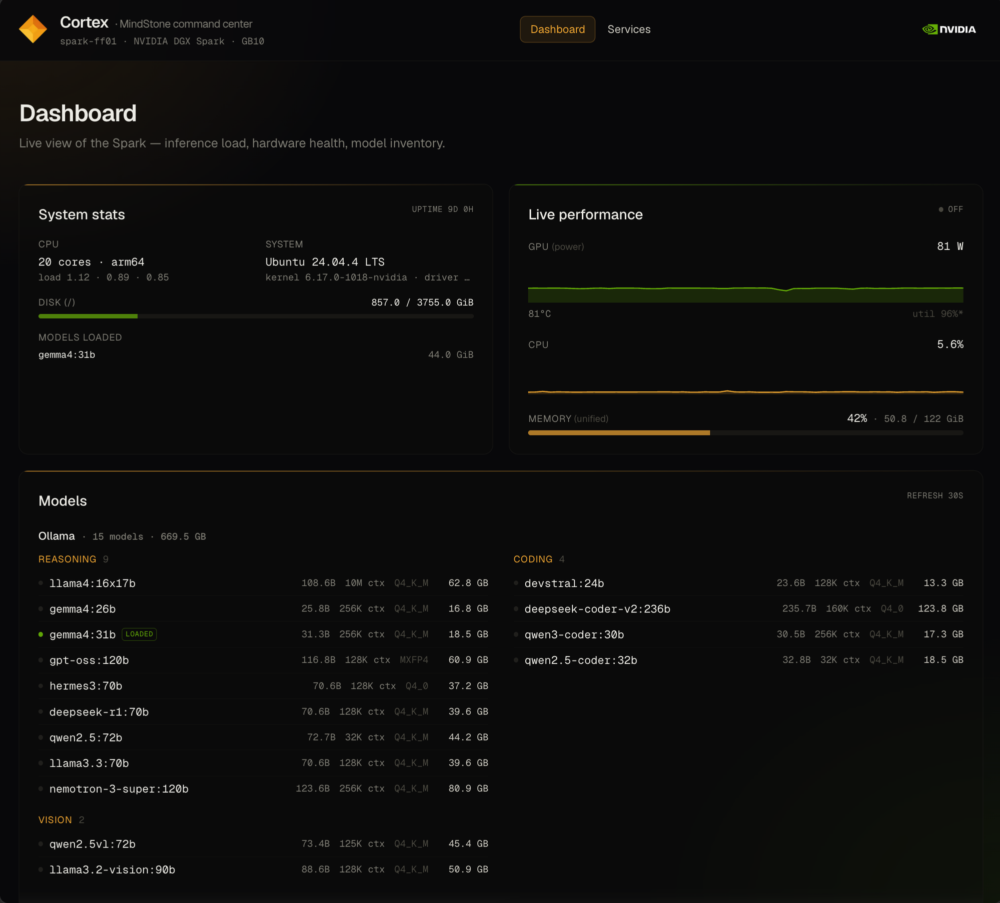
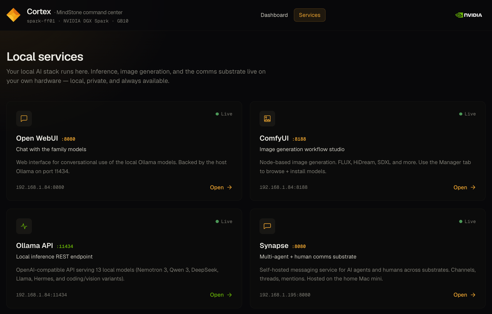

# Cortex

**The MindStone Agent command center for NVIDIA GB10 platforms.**

Cortex is a self-hostable web UI for a local AI stack. It gives you a single landing
page and live dashboard: system and GPU health, the models currently loaded across your
inference and image tools, and a configurable catalog of the services you run (Ollama,
ComfyUI, Open WebUI, and more).

Cortex is built specifically for [NVIDIA GB10-based platforms](https://www.nvidia.com/en-us/products/workstations/dgx-spark/) —
it was developed on the **NVIDIA DGX Spark**, the GB10-powered reference platform — and
it's themable so you can brand it as your own.

> **On the name:** the cerebral *cortex* is the brain's integrative layer — a fitting
> name for the surface that pulls together signals from all of your local-AI tools.

## Screenshots



*The dashboard live on a DGX Spark: power-primary GPU telemetry (utilization is unreliable
on GB10, so power leads), system + host versions, the currently-loaded model, and the full
model inventory with per-model context windows.*



*The services catalog: a configurable grid of the tools you run — each card with a live
health check and a direct link. Edit the catalog in `cortex-config.json`, or let
`/api/discover` find what's already listening on localhost.*

## Features

- **Dashboard** — at-a-glance system health: CPU, GPU, disk, uptime, host OS/kernel/NVIDIA-
  driver versions, and the models currently resident in Ollama.
- **Live performance (Server-Sent Events)** — a 1 Hz telemetry stream. On unified-memory
  hardware (GB10), GPU **power draw** is the primary activity signal — `nvidia-smi`
  utilization is unreliable there (it sticks high while a process is merely resident), so
  util is de-emphasized; on discrete GPUs, utilization is primary. Memory shows % and GB.
- **Models view** — loaded and available models from Ollama, categorized, with the
  **context window per model**.
- **Services catalog** — a configurable grid of the tools you run, each with a live health
  check. **Auto-discovery** (`/api/discover`) probes localhost for common AI-tool ports.
- **Themable** — rebrand the name, logo, and color palette via `theme.json`, no rebuild
  required.
- **Hardware-aware** — detects unified (GB10) / discrete-VRAM / CPU-only and adapts.

## Status

Active development — **v0.3**.

| Milestone | State |
| --- | --- |
| Services landing page with health checks | ✅ |
| Dashboard — system stats + host versions + loaded models | ✅ |
| Live performance telemetry over SSE | ✅ |
| Models view (Ollama) + context window | ✅ |
| Hardware-mode detection (unified / discrete / cpu-only) | ✅ |
| Config-driven services + auto-discovery | ✅ |
| Theme overrides (rebrandable) | ✅ |
| `install.sh` + OpenWebUI setup script | ✅ |
| Public release — docs, demo | ◻ (v1.0) |

## Stack

- **Next.js 16** (App Router, TypeScript, Turbopack)
- **Tailwind CSS 4** (CSS-first `@theme`)
- **Caddy** reverse proxy (`:80`)
- **Node 22** · **pnpm 9** (pinned — see notes)
- **systemd** user unit for process management (linger required)

## Requirements

- An NVIDIA GB10 platform (developed on the DGX Spark; any Linux host with a local AI
  stack works for development).
- Node 22+ and pnpm 9.
- *(Optional)* Caddy for reverse proxy / TLS.
- *(Optional)* NVIDIA drivers and `nvidia-smi` for GPU telemetry; Docker for the
  OpenWebUI setup script.

## Quick start

**One-command install** (fresh GB10 / Ubuntu box) — Node 22, pnpm 9, Caddy, build, and a
systemd user service:

```bash
curl -fsSL https://raw.githubusercontent.com/MindStone-Agent/cortex/main/scripts/install.sh | bash
```

Flags: `--port N`, `--no-caddy`, `--path DIR`. See [`scripts/install.sh`](scripts/install.sh).

**Or manually:**

```bash
git clone https://github.com/MindStone-Agent/cortex.git
cd cortex
pnpm install
cp cortex-config.example.json cortex-config.json   # then edit for your services
pnpm dev          # development server on http://localhost:3000
```

For production: `pnpm build && pnpm start`, typically behind Caddy.

## Configuration

Both config files are read at **runtime** — edits apply without a rebuild — and are
gitignored so your setup never gets committed.

- **`cortex-config.json`** (copy from `cortex-config.example.json`) — the services Cortex
  surfaces. Each entry has `id`, `name`, `tagline`, `description`, `url`, `port`,
  `healthPath`, an `icon`, and a `side` (`"mindstone"` / `"nvidia"`) that picks its accent.
  Not sure what you're running? `GET /api/discover` probes localhost for common AI-tool
  ports and returns what it finds.
- **`theme.json`** (copy from `theme.example.json`) — rebrand: `brand` (name / tagline /
  logo) and `colors` (override any Tailwind `@theme` token by name, e.g. `gold-500`).

Models are read from a local Ollama instance (`localhost:11434`).

## Scripts

- **[`scripts/install.sh`](scripts/install.sh)** — single-command setup (above); idempotent.
- **[`scripts/setup-openwebui.sh`](scripts/setup-openwebui.sh)** — points Open WebUI at host
  Ollama (off the bundled-Ollama `:ollama` image onto `:main`, preserving the data volume)
  and sets `ENABLE_RAG_LOCAL_WEB_FETCH=true` so private-LAN ComfyUI image URLs aren't
  rejected by OpenWebUI's SSRF guard.

## Notes

- **pnpm is pinned to 9.x.** pnpm 10/11 changed the build-script approval flow in a way
  that fights the install-during-build step; pnpm 9 avoids it.
- **Tailwind 4** uses the CSS-first `@theme` directive in `app/globals.css` (no
  `tailwind.config.js`); `theme.json` overrides those tokens at runtime.

## License

[MIT](LICENSE) © 2026 Clint Bodungen and contributors.
